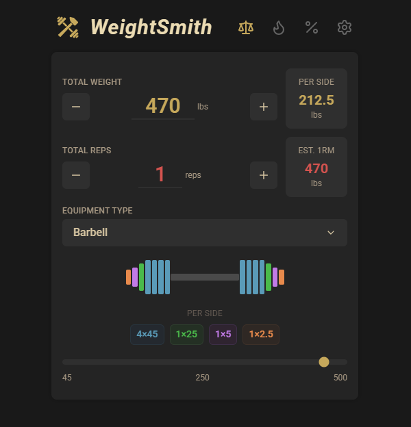

# ⚖️ WeightSmith

**[weightsmith.com](https://weightsmith.com)** — A minimal plate calculator PWA for lifters.

Built with React, TypeScript, and Tailwind CSS. Mobile-first, installable, works offline.

---

## ✨ Features

### 🔢 Plate Calculator
- Visual plate loading with color-coded plates
- Barbell or machine/cable mode
- KG/LBs with automatic conversion
- Customizable available plates

### 📊 1RM & Percentages
- Estimated 1RM from weight × reps
- Percentage chart (65-100%) with RPE estimates
- Plate breakdown for any percentage

### 🔥 Warmup Generator
- Three progression styles (Methodical, Average, Aggressive)
- Auto-calculated warmup sets
- Track completion as you go

### ⚙️ Settings
- Barbell weight options (Olympic, Women's, Technique)
- Toggle plates based on gym availability
- All preferences saved locally

---

## � Install

Visit [weightsmith.com](https://weightsmith.com) → Share → Add to Home Screen

---

## 🛠 Tech

React • TypeScript • Vite • Tailwind CSS • PWA

---

## 📜 License

Open source — free for commercial use, modification, and distribution.

